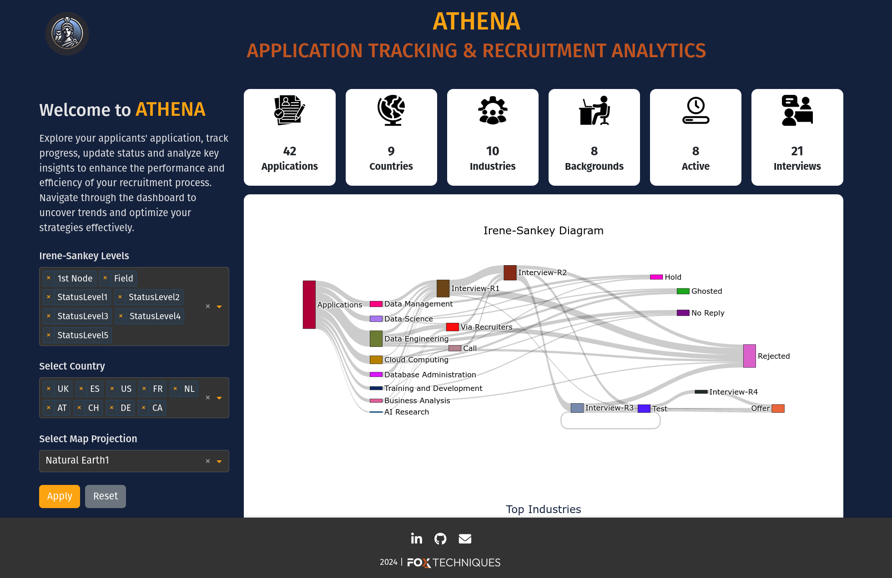
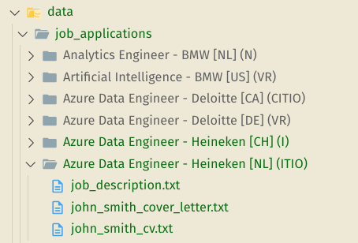

# Demo 

## A Glance on ATHENA


=== "Screenshot 1"

    { width=800 }

=== "Screenshot 2"

    { width=800 }
    
=== "Screenshot 3"

    { width=800 }


## How to Use

ATHENA expects job applications to be organized in a specific folder structure and file naming convention. This guide will help you structure your data correctly to ensure smooth parsing and analytics.

### Folder Structure

Organize your data in a folder structure with the following naming format for each application:

```
<position> - <company> [<country_code>] (<status>)
```

Details of the Format:

- <position>: The role or title of the position (e.g., "Software Engineer").
- <company>:  The name of the company where the application was submitted (e.g., "Google").
- [<country_code>]:  The country code in square brackets based on ISO 3166-1 alpha-2 (e.g., [US] for the United States). In case of missong country code, ATHENA maps the postion to The Netherlands (NL).
- (<status>): The status of the application enclosed in parentheses, represented by a combination of the status mappings.

Example of the folder structure: 



### Status Mapping

The status is a combination of one or more of the following codes:

|Code |	Status	| Description |
| --- | ---     | ---         |
|S |	Submitted |	Application submitted |
|N |	No Reply |	No response received |
|H |	Hold | Position is on hold |
|C |	Call |	HR Called the Applicant | 
|V |	Via Recruiters	| Application forwarded via a recruiter |
|I |	Interview | Interview scheduled |
|T |	Test | Assessment/test is forwarded |
|A |	Assignment | Additional assignment/project required |
|O |	Offer | Job offer sent |
|F |	Followed-up	| Follow-up communication sent |
|G |	Ghosted	| No response after initial communication |
|R |	Rejected | Rejection email is sent |

Status mapping is located in `/data/mappings/status.json`

### Run the ATHENA Dashboard

Start the dashboard application:

```bash
python app.py
```

Open your web browser and navigate to:

```bash
http://127.0.0.1:8050/
```

Thank you for exploring our demo! We hope this example has given you a clear understanding of how to utilize our dashboard and integrate its features into your projects. Whether you're just getting started or diving deeper, our goal is to make your experience as seamless and productive as possible.

Happy coding!