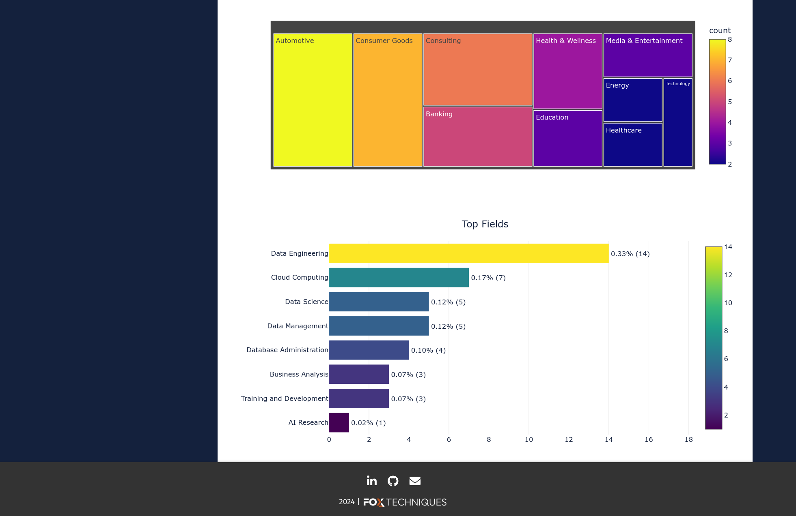
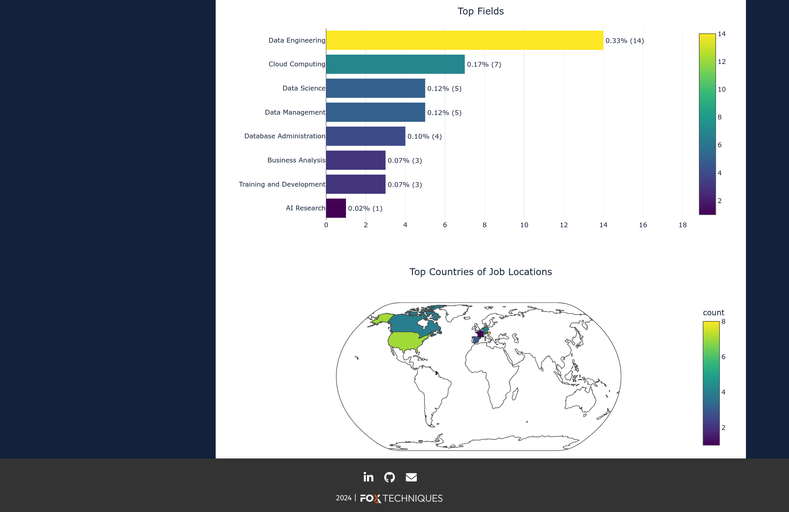

# Demo 

## A Glance on ATHENA

=== "Screenshot 1"

    { width=800 }

=== "Screenshot 2"

    { width=800 }
    
=== "Screenshot 3"

    { width=800 }

## How to Use

Thank you for exploring our demo! We hope this example has given you a clear understanding of how to utilize our package and integrate its features into your projects. Whether you're just getting started or diving deeper, our goal is to make your experience as seamless and productive as possible.

Happy coding!