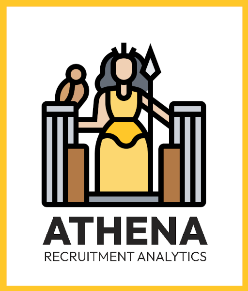

# ATHENA: Recruitment Analytics

{ width=200 }

**ATHENA** is a Plotly dashboard solution designed to streamline the recruitment process by providing comprehensive analytics and insights into job applications. With interactive visualizations, dynamic data filtering, and key performance metrics, ATHENA empowers users to track, analyze, and optimize their recruitment strategies. From identifying top industries and fields to visualizing application trends across countries, ATHENA delivers actionable insights to enhance decision-making and drive recruitment success.

## 🌟 Key Features

- 📊 **Interactive Dashboards:** Visualize data with treemaps, bar charts, choropleth maps, and IRENE-Sankey diagrams.
- 📈 **Key Metrics at a Glance:** Track essential statistics such as the number of applications, countries, industries, active applications, and interviews.
- 🎛️ **Dynamic Filtering:** Adjust visualizations using filters for industries, countries, fields, and projections.
- 🔍 **Comprehensive Visual Insights:** Explore IRENE-Sankey flow diagram, top industries, application fields, and geographical trends.
- 🌍 **Customizable Projections:** Switch between different map projections for geographical analysis.
- 🛠️ **Modular and Extensible Design:** Easily adaptable for additional features and data inputs.
---

## 🔗 Quick Links

- [GitHub Repository](https://github.com/fox-techniques/athena-recruitment-analytics)
- [License](https://github.com/fox-techniques/athena-recuitment-analytics/blob/main/LICENSE)

Explore the documentation to learn how to customize and make the most of **ATHENA**!
